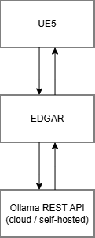

# E.D.G.A.R.s

E.D.G.A.R.s is a small and lightweight API server that sits between LLM (currently just Ollama API)
and UE5 or possibly any client. It uses WebSockets to establish two-way, realtime communication between client and LLM
server.

## Why use E.D.G.A.R.s?

Normally you can call LLM (Ollama) API directly via HTTP protocol and get result in single response.
Unless you need realtime streaming capacities which most LLMs provide
via [server-sent events](https://developer.mozilla.org/en-US/docs/Web/API/Server-sent_events/Using_server-sent_events).
Unfortunately, UE5 doesn't support server-sent events, so you need to use WebSockets instead.
Host E.D.G.A.R.s on the same machine as UE5 and potentially connect to a remote Ollama server.


## Tech Stack

- **Python** — Core runtime
- **FastAPI** — HTTP endpoints and WebSocket handling
- **Ollama** — Local LLM inference backend
- **WebSockets** — Realtime bidirectional communication between client and E.D.G.A.R.s

## What can E.D.G.A.R.s do?

- Call Ollama REST API
- Receive and beam Ollama streamed response to caller (UE5) using WebSockets
- Manage chat (session) context
- Handle tool calls with respect to a given prompt context
- Override model configuration options passed to Ollama

## When not to use E.D.G.A.R.s?

- **Public-facing service without proper authentication.** E.D.G.A.R.s is not designed to be exposed publicly — this can
  cause unexpected behaviour and possible race conditions.
- **Direct Ollama access.** If your client already supports SSE or you don't need streaming, call the Ollama API
  directly.

## Quick Start

### Prerequisites

- Python 3.11+
- [Ollama](https://ollama.com/) installed and running with at least one model pulled (e.g. `ollama pull qwen3:8b`)

### Setup

```bash
# Clone the repository
git clone https://github.com/<your-org>/edgars.git
cd edgars

# Create virtual environment
python -m venv .venv
source .venv/bin/activate  # Linux/macOS
# .venv\Scripts\activate   # Windows

# Install dependencies
pip install -r requirements.txt
```

### Run

```bash
# Make sure Ollama is running
ollama serve

# Start E.D.G.A.R.s
uvicorn app.main:app --host 0.0.0.0 --port 8000
```

> **Note:** Adjust `app.main:app` to match your actual FastAPI entrypoint if it differs.

### Configuration

E.D.G.A.R.s can be configured via environment variables:

<!-- TODO: List actual env vars (OLLAMA_HOST, PORT, etc.) -->

| Variable      | Default                  | Description              |
|---------------|--------------------------|--------------------------|
| `OLLAMA_HOST` | `http://localhost:11434` | Ollama server URL        |
| `HOST`        | `0.0.0.0`                | E.D.G.A.R.s bind address |
| `PORT`        | `8000`                   | E.D.G.A.R.s listen port  |

## Architecture

E.D.G.A.R.s acts as a protocol bridge. The client (UE5 or any WebSocket-capable app) connects to E.D.G.A.R.s over
WebSocket. E.D.G.A.R.s then forwards prompts to the Ollama HTTP API, consumes the streamed SSE response, and relays each
chunk back to the client in real time over the open WebSocket connection.

Each client session is identified by a UUID. Sessions maintain their own chat history and configuration, allowing
multiple independent conversations.



## E.D.G.A.R.s Endpoints

### GET `/ws?session_id={UUID}`

Establishes a long-lived WebSocket connection to the E.D.G.A.R.s server. The provided session ID must be a
well-formatted UUID. A session is either created or resumed (reconnecting after WS disconnection).

See [WebSocket Protocol](#websocket-protocol) for message format details.

### PUT `/api/v1/sessions/{session_id}/configuration`

Configures the current session. The session ID (route parameter) must be a well-formatted UUID, and the body must be a
JSON object with configuration options. This configuration is applied to all subsequent prompt/chat messages in the
session.

<!-- TODO: Document available configuration keys and their defaults -->

### DELETE `/api/v1/sessions/{session_id}`

Deletes the current session and its chat history.

## WebSocket Protocol

Once a WebSocket connection is established, the client and server exchange JSON messages. Below is the high-level flow:

1. **Client sends a prompt** — a JSON message containing the user's input and optional parameters.
2. **Server streams response chunks** — as Ollama generates tokens, E.D.G.A.R.s relays each chunk to the client
   immediately.
3. **Tool calls (if any)** — when the LLM decides to invoke a tool, E.D.G.A.R.s sends a tool-call message. The client
   executes the tool and responds with the result.
4. **Completion** — a final message signals the end of the response. Session context is then cleared for the next
   prompt.

### WS Message Formats

#### Client ←→ E.D.G.A.R.s WebSocket Message Format

Reason why WebSocket message has following format is due to future improvements especially introducing FlatBuffers for
chunked messages.

```json
{
  "headers": [
    {
      "name": "string",
      "value": "string"
    }
  ],
  "body": "string"
}
```

**Example**

```json
{
  "headers": [
    {
      "content-type": "text/plain",
      "prompt-id": "feaec605-7198-4e14-b424-ad1260bd2bec"
    }
  ],
  "body": "hi there!"
}
```

#### Known Headers and Types

```typescript
KnownHeaders = {
    prompt_id: 'prompt-id', // (required) UUID - signals prompt context for chunks and tool calls
    tool_call_id: 'tool-call-id', // (optional) UUID - signals tool call id for callback actions
    chunk_id: 'chunk-id', // (optional) UUID - signals assistant response chunk
    content_type: 'content-type', // currently optional, but will be required in future
    role: 'role', // mostly for message routing on client side
    signal: 'signal', // signalization with minimal data overhead
}

SignalType = {
    request_complete: 'request_complete', // user prompt was completed on E.D.G.A.R.s side
    tool_call_waiting: 'tool_call_waiting', // E.D.G.A.R.s is waiting for all tool calls to be completed from client
}

ContentType = {
    text_plain: 'text/plain',
    json: 'application/json',
    json_tool_call: 'application/json+tool_call',
    empty: 'empty'
}

KnownRoles = {
    user: 'user',
    tool: 'tool',
    system: 'system',
    assistant: 'assistant',
}
```

## Example Demo

Demo available at [https://edgar-ai-4b652.web.app/](https://edgar-ai-4b652.web.app/)

As a demonstration, there is a simple Vue app that integrates with a remote E.D.G.A.R.s server written in Python. The
app is styled as a retro terminal interface.

> Due to the fact this was a quick demo, the app is not exactly intuitively designed. Here is a simple how-to guide:

### Basic controls

- Type commands via your physical keyboard
- Press **Enter** to send a command
- Press **Escape** to cancel the current command or focus the command line

### Initial screen

- The first screen is a simple menu styled as a terminal. You can enter commands (type `help` for a list), and the
  terminal will react accordingly. There is no LLM or AI being used here.
- The `play` command starts a new game session. You will be given a new session ID and a screen that connects to the
  E.D.G.A.R.s server using WebSockets in the background.

### Game screen

- This screen is connected to the remote server, but will not interact with the LLM unless you start your command with
  `:` (colon).
    - Entering `:Hi` for example will trigger a full chat round:
        1. The prompt is sent through WebSockets to E.D.G.A.R.s, which forwards it to Ollama.
        2. Ollama processes the prompt and streams back chunks of content, thinking, or tool calls.
        3. These chunks are relayed back to the client in real time, along with any tool calls. The user prompt context
           is persisted unless a new prompt arrives.
        4. Once all tool calls are processed and the assistant finishes the chunked response, the prompt context is
           cleared.

### Tool calls in action

Tool calls allow the LLM to interact with external "tools" — meaning the LLM can execute commands on the UE5 side. In
the demo, there are several doors that the LLM can logically interact with, as well as a set of "Life support" systems (
oxygen, temperature) that can be adjusted via tool actions.

It's fun to experiment with how the LLM understands these functions, as it relies entirely on your description of what
the tools do. For example, telling the LLM `:Close all doors` will trigger a sequence of:

- Checking door state (`list_doors`)
- Closing doors one by one (`set_door_state`) — intentionally, only an individual door state manipulation function is
  provided, to test whether the LLM can chain or duplicate these calls on its own.